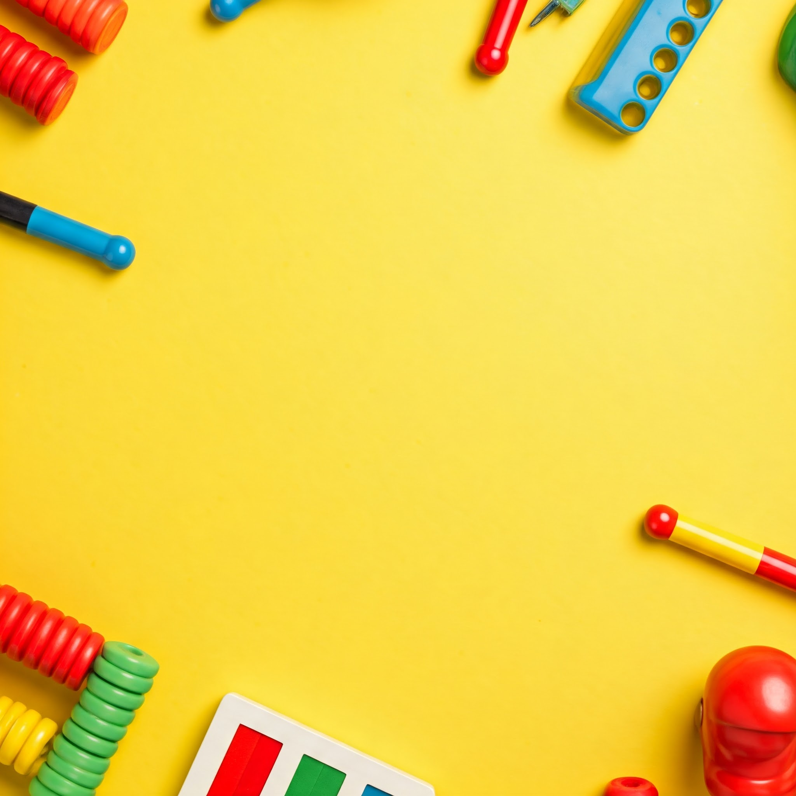

Velit deserunt exercitation laboris est ullamco culpa. Commodo tempor mollit reprehenderit sit eiusmod exercitation laboris id pariatur magna deserunt anim labore.

## Aprender jugando: el motor del desarrollo.

Mollit deserunt do non deserunt elit ad occaecat. Laborum occaecat nisi ea ex adipisicing dolore et officia. Elit magna in nulla ut id aliquip incididunt nulla officia. Ullamco velit cupidatat esse cillum proident exercitation do deserunt. Cupidatat minim consequat tempor pariatur incididunt aliquip laboris aute velit ipsum.

Et consectetur et eu dolore irure culpa aliqua irure. Ullamco magna in reprehenderit fugiat aute proident. Irure eiusmod dolore consequat occaecat non duis dolor dolor enim aliquip quis do.

Irure eiusmod officia laboris in adipisicing eiusmod. Qui tempor elit irure voluptate amet eiusmod duis exercitation veniam. Labore nulla reprehenderit excepteur dolore.
